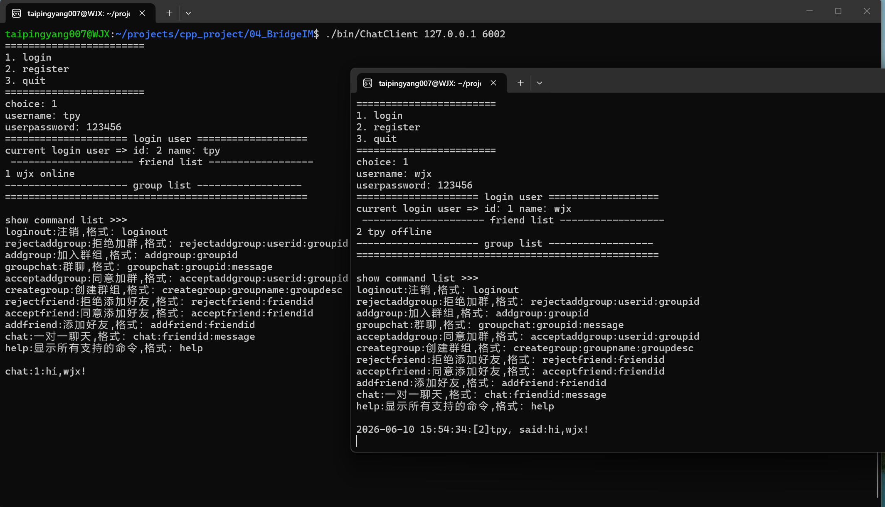

# BridgeIM — C++ IM 后端


多节点即时通信后端，技术重点在**网络层与业务层的线程分离、粘包与背压处理、以及内部服务的 RPC 边界设计**。功能覆盖注册登录、单聊、群聊、好友管理与离线消息，可经 Nginx 负载均衡部署为多节点集群，跨节点消息通过 Redis 投递。

**技术栈**：C++11 · Muduo · Nginx · Redis · MySQL · Protobuf · mprpc · ZooKeeper · Docker Compose

## 项目概览 · Overview

- **完整 IM 业务**：注册 / 登录 / 登出、单聊、群聊、好友请求与同意、离线消息。
- **多节点部署**：客户端经 Nginx 入口接入，两个对等 ChatServer 节点运行，跨节点消息经 Redis 投递。
- **服务化拆分**：好友域、离线消息域已从主进程拆为独立 RPC 服务（Protobuf + ZooKeeper 注册发现）。
- **工程规模**：约 5.4k 行 C++11，`./scripts/build/all.sh` 一键构建、`./scripts/demo/bridgeim-demo.sh` 一键起多节点 demo。

技术深度集中在三处：**① 网络/业务线程分离与背压**、**② 粘包分帧**、**③ RPC 服务边界与协议设计**。下面逐条展开。

## 核心亮点 · Highlights

**1. 网络层与业务层线程分离 + 有界线程池 + 背压**

Muduo IO 线程只负责收包、分帧、JSON 解析，所有业务与数据库操作投递到独立的业务线程池执行，避免慢查询阻塞网络层。线程池为**有界队列 + `future` 返回值 + 显式 `shutdown()`**：队列满时**快速失败**并向客户端返回 `server busy`，而非无限堆积；worker 内业务异常被捕获隔离，不会拖垮整个线程。
代码：[chatserver.cpp:114-131](src/server/chatserver.cpp#L114-L131)、[ThreadPool.cpp](src/common/concurrency/ThreadPool.cpp)

**2. 粘包处理：newline 分帧 + 按连接缓冲**

外部协议是 `\n` 分隔的 JSON 文本帧。每条连接维护独立接收缓冲，`onMessage` 累积字节后循环切出完整帧再交给业务层，正确处理 TCP 粘包/半包；空帧、缺 `msgid`、JSON 解析失败均分类捕获并记录，不影响后续帧。
代码：[chatserver.cpp:70-146](src/server/chatserver.cpp#L70-L146)

**3. 内部 RPC 服务拆分 + Protobuf 协议设计**

好友域（`FriendService`）和离线消息域（`OfflineMessageService`）拆为独立进程，经 mprpc + Protobuf 通信，ZooKeeper 注册发现。Protobuf 协议带明确的语义设计：用 `QueryStatus` 区分「业务结果（用户不存在）」与「DB 错误」、enum 加前缀规避同包命名空间冲突、请求状态用 `string` 而非 enum 以兼容未来扩展。
代码：[friend_service.proto](proto/friend_service.proto)、[friend_service/main.cpp](src/services/friend_service/main.cpp)

**4. 支撑设施：Redis 跨节点投递 + MySQL 连接池**

`deliverMessage()` 先查本地在线连接；目标用户在其他节点时经 Redis pub/sub 跨节点投递，离线则落库到离线消息服务。数据库侧用 `DbSession` / `QueryResult` 对连接池做 RAII 封装，避免每请求建连开销。**Redis 只做消息 fanout，ZooKeeper 只做服务发现，职责不混。**
代码：[redis.cpp](src/server/redis/redis.cpp)、[common/db/](src/common/db/)

## 消息处理路径 · Request Path

一条单聊消息从进入到送达，串起上面四个零件：

```text
ChatClient
  └─ Muduo IO 线程：收字节 → 按 \n 分帧 → JSON 解析 → getHandler(msgid)
       └─ 投递业务线程池（队列满 → 直接回 server busy）
            └─ ChatService 业务 handler
                 ├─ 好友校验：RPC 调 FriendService（ZooKeeper 发现）
                 ├─ 读写用户/消息：MySQL 连接池
                 └─ deliverMessage：本地在线直发
                                  / 目标在异节点 → Redis 投递
                                  / 离线 → 落库 OfflineMessageService
```

IO 线程只碰网络与分帧，业务/DB/RPC 全在业务线程池里跑——这是整套设计的主线。

## 效果演示 · Demo



上图为真实运行截图：`tpy`(id 2) 登录到节点 `:6002`，发出的单聊 `chat:1:hi,wjx!` 经 **Redis 跨节点**投递，另一节点上的 `wjx`(id 1) 实时收到 `[2]tpy，said:hi,wjx!`。

服务启动时，RPC 服务把每个方法按节点注册进 ZooKeeper，ChatServer 接好 Redis 后开始监听（启动日志摘录）：

```text
[RPC][INFO] register rpc provider node service=friend_service method=isFriend \
            path=/mprpc/friend_service/isFriend/providers/provider-0000000006 target=127.0.0.1:7001
[RPC][INFO] rpc provider start bind=127.0.0.1:7001 advertise=127.0.0.1:7001 threads=4
[INFO] redis module started successfully
[INFO] ChatServer started at 0.0.0.0:6000
```

> 一键复现见 [docs/demo.md](docs/demo.md)。

## 外部协议 · Wire Protocol

客户端与服务端之间是 `\n` 分隔的 JSON 文本帧，`msgid` 标识消息类型（定义见 [public.hpp](include/public.hpp)）。示例：

```jsonc
// 登录请求（client -> server），msgid=1
{"msgid":1,"name":"zhangsan","password":"123456"}

// 单聊（client -> server），msgid=6；目标在异节点时经 Redis 原样转发给 B
{"msgid":6,"userid":13,"name":"zhangsan","to":15,"msg":"hi lisi","time":"2026-06-10 10:24:01"}
```

内部服务间通信改用 Protobuf（见 [proto/](proto/)）——外部协议求稳定可读，内部 RPC 求高效，协议边界显式分层。

## 架构设计 · Architecture

```text
ChatClient
  -> Nginx :8000
  -> ChatServer node A :6000
  -> ChatServer node B :6002

ChatServer
  -> Redis pub/sub
  -> MySQL chatserver
  -> mprpc Channel
      -> FriendService :7001
      -> OfflineMessageService :7000

ZooKeeper :2181
  -> RPC service registration/discovery
```

**关键设计决策**

| 决策 | 理由 |
|------|------|
| Live TCP 连接所有权留在 ChatServer | 在线状态、跨节点路由、连接清理需要整体协调；过早把连接所有权下沉到 RPC 会引入不必要的分布式复杂度 |
| Redis 做跨节点 fanout，ZooKeeper 只做服务注册发现 | 职责分离；用 ZooKeeper 做消息 fanout 会引入额外的状态管理负担 |
| 外部协议 JSON+newline，内部 RPC 用 Protobuf | 外部协议稳定可读，内部服务间通信高效；协议边界显式分层 |

## 快速开始 · Quick Start

**依赖**

```
g++, cmake >= 3.16, libmysqlclient-dev, libhiredis-dev,
libboost-dev, protobuf, zookeeper_mt, Muduo, Docker / Docker Compose
```

**构建**

```bash
git clone --recursive <repo-url>
cd BridgeIM
./scripts/build/all.sh
```

产物：`bin/ChatServer`、`bin/ChatClient`、`bin/FriendService`、`bin/OfflineMessageService`

**首次初始化**

```bash
cp .env.example .env            # 按需修改 MySQL/Redis/ZooKeeper 连接参数
MYSQL_ROOT_PASSWORD=<root-password> ./scripts/db/bootstrap-mysql.sh
```

**一键运行 Demo**

```bash
./scripts/demo/bridgeim-demo.sh
```

脚本自动拉起依赖服务、两个 RPC 服务进程和两个 ChatServer 节点，并打印客户端连接命令。详见 [docs/demo.md](docs/demo.md)。

## 目录结构 · Project Layout

```text
./
├── CMakeLists.txt
├── cmake/                 # CMake 依赖、Protobuf、模型目标模块
├── compose.yaml           # Redis + Nginx 本地依赖栈
├── docker/                # Nginx / Redis 配置
├── docs/                  # Demo 演示文档与架构路线图
├── include/               # 公共头文件
├── proto/                 # Protobuf 服务定义
├── scripts/               # 构建、演示、DB 初始化和检查脚本
├── src/                   # 客户端、网关、公共库、RPC 服务
├── test/                  # 独立测试程序
└── third_party/mprpc      # mprpc git submodule
```

生成物不入库：`build/`、`bin/`、`logs/`、`.env`

## 演进路线 · Roadmap

本项目有意分阶段推进：**先稳定单体网关与公共基础设施，再把边界清晰的业务域拆到 RPC 之后**。好友域与离线消息域已完成拆分；用户域、群组域是下一步自然的拆分对象。

完整分布式 IM 的真正难点不在「多拆几个服务」，而在 **presence 与消息路由**——live socket 连接无法经 RPC 搬运，需要 `user → 网关节点` 的在线表、节点健康检查、异常下线清理与跨网关路由契约。这属于更大的分布式系统设计，1.0 有意止步于此，把 live 连接所有权保留在 ChatServer 这一当前最合适的位置。

详见 [docs/architecture-roadmap.md](docs/architecture-roadmap.md)。
